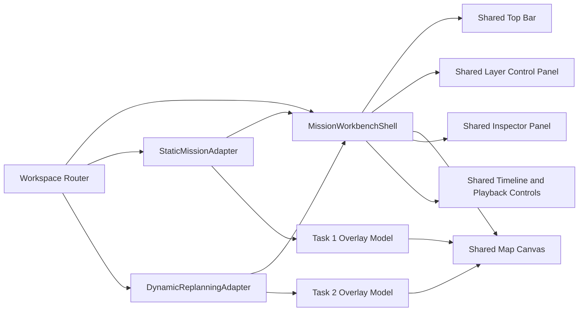

# Task 2 Decision Replay and Shared Mission Workbench Design

Date: 2026-07-31

Status: Approved in design discussion; awaiting written-spec review

## 1. Context

The current Task 2 demo correctly freezes mission time around a dynamic event,
but it does not explain what the replanning system does during that pause. It
also implements a second, reduced workspace instead of reusing the mature Task
1 map, layer controls, timeline, detail panels, preferences, and camera
behavior.

This causes both product and correctness problems:

- the final plan status and final resource/task states are visible before the
  event;
- a newly added task polygon is visible before the new-task event;
- candidate summaries, metrics, PlanDiff, work-unit paths, and failure reports
  are loaded or projected but not presented;
- the browser cannot show a truthful stage-by-stage decision process because
  the backend export does not contain one;
- Task 2 layers have fixed colors and no visibility, opacity, width, palette,
  or reset controls;
- Task 1 and Task 2 have separate top bars, sidebars, timelines, drawers, and
  map state management;
- clicking controls inside the map panel can disable automatic camera movement,
  even when the user did not drag the map;
- the event halo is a fixed Deck.gl icon while CSS attempts to animate a
  non-existent DOM element;
- scene activation does not reliably restore the scene camera;
- `overviewPaddingPx` is exported but unused;
- modified paths appear abruptly rather than transitioning continuously;
- event and plan-commit markers overlap on the mission-time axis and do not
  explain the elapsed decision presentation.

## 2. Goals

1. Show a truthful, understandable decision replay while mission time is
   frozen.
2. Provide two levels of information:
   - a default presentation layer for non-engineering audiences;
   - expandable audit details containing real candidates, checks, metrics,
     failure codes, PlanDiff, and provenance.
3. Keep the frontend independently runnable with pre-generated scene packages.
4. Replace the two parallel workspaces with one shared mission workbench and
   two mode adapters.
5. Reuse Task 1 layer controls, color editing, persistence, timeline,
   inspection, basemap, and camera capabilities.
6. Preserve Task 1 features, data behavior, imports, and existing cases while
   allowing the shared shell to change.
7. Prevent phase spoilers: data and status must appear only when the replay has
   reached the corresponding stage.
8. Make layer semantics understandable with both color and line style.
9. Provide browser-level regression coverage for real interaction, Canvas
   rendering, 1366x768 layout, and reduced motion.

## 3. Non-goals

- Running the Python replanning engine live from the browser.
- Supporting arbitrary Task 1 cases as dynamic scenarios in this redesign.
- Changing the Task 2 ranking policy or planning algorithm.
- Replacing Kepler.gl or Deck.gl.
- Redesigning unrelated Task 1 data conversion or import formats.
- Presenting invented decision records when backend trace data is absent.

The four existing Task 2 scenarios remain the supported dynamic scene library:

- `resource-lost`;
- `low-fuel-return`;
- `new-area-task`;
- `hard-deadline-fallback`.

## 4. Approved Product Decisions

- The workbench uses a fixed left layer panel, central map, fixed right
  inspection/decision panel, and bottom timeline.
- The right panel is collapsible but never overlays the map while expanded.
- Decision steps advance automatically by default.
- The user can select previous step, pause, or next step. Manual interaction
  switches the decision replay to manual control; "continue automatic replay"
  restores automatic progression.
- Colors default to change-type semantics and can switch to UAV semantics.
- Line style always preserves change semantics, regardless of color mode.
- Backend export adds a real `decision_trace.v1.json`.
- Task 1 and Task 2 use a shared shell with separate mode adapters.
- Task 1 behavior and data remain intact, but its shared shell may be
  refactored.

## 5. Architecture



### 5.1 MissionWorkbenchShell

`MissionWorkbenchShell` owns layout and common interaction only:

- task-mode switch;
- data-source selector slot;
- basemap style, height scale, reset-view, and shared actions;
- layer panel;
- map panel;
- timeline;
- right inspector panel;
- loading, empty, and error states.

It does not read Task 1 bundles, Task 2 MissionView, events, candidates, or
failure reports directly.

### 5.2 WorkbenchModeAdapter

Each mode exposes a declarative view model through a common adapter contract.
The contract provides:

- mode identity and current source selection;
- current contextual status;
- grouped layer definitions and preference values;
- a standard map overlay model;
- playback state and controls;
- mission-time markers;
- inspector content;
- object selection handlers;
- initial, event-focus, result-overview, and restored camera states;
- error and retry behavior.

`StaticMissionAdapter` wraps the current case library, import flow, mission
clock, Task 1 layer projection, Task 1 preferences, and Task 1 detail data.

`DynamicReplanningAdapter` wraps the dynamic scene library, dual-clock replay,
decision-trace replay, phase-aware scene projection, plan comparison,
interpolation, and fallback details.

### 5.3 State ownership

Shared state:

- active mode;
- basemap style;
- height scale;
- left and right panel collapsed state;
- right panel width;
- active camera-follow policy.

Mode-scoped session state:

- selected Task 1 case or Task 2 scene;
- mission-time position and playback rate;
- Task 2 decision stage and auto/manual control mode;
- selected map object;
- layer preferences;
- last camera state.

Switching modes preserves each mode's session state. It must not trigger an
eager reset of the inactive mode or replace its saved camera.

### 5.4 Shared map contract

`WrjKeplerMap` no longer receives mutually exclusive Task 1 and Task 2
properties such as `bundle`, `preferences`, and `dynamicOverlay`.

It receives one `WorkbenchOverlayModel` containing:

- stable ordered Deck.gl layers;
- selection callbacks;
- animation update triggers;
- optional interaction callbacks;
- a semantic object index for inspection.

The adapters remain responsible for business-specific projection. The map
remains responsible only for rendering and reporting actual map interaction.

## 6. Decision Trace Contract

The backend creates `decision_trace.v1.json` during the actual pipeline run.
It is not reconstructed from MissionView after completion.

The contract contains:

```text
schemaVersion
attemptId
missionId
eventBatchId
sourcePlanVersion
resultStatus
selectedCandidateId
stages[]
candidates[]
selection
publication
```

### 6.1 Required stages

Every trace uses this stable order:

1. `EVENT_INGESTION`
2. `SNAPSHOT_AND_IMPACT`
3. `RESOURCE_ASSESSMENT`
4. `CANDIDATE_GENERATION`
5. `PLANNING_AND_VALIDATION`
6. `RANKING_AND_SELECTION`
7. `PLAN_PUBLICATION`

Each stage contains:

- `stageId`;
- `status`: `COMPLETED`, `FAILED`, or `SAFE_FALLBACK`;
- `actualDurationMs`;
- affected event and object IDs;
- structured fact records used by the presentation summary;
- candidate IDs involved in the stage;
- validation-check IDs;
- failure codes;
- references to published artifacts where applicable.

Backend trace records contain structured codes and values rather than
hard-coded localized prose. The frontend maps known codes to concise Chinese
presentation text. Unknown codes remain visible in their raw form in the audit
details.

### 6.2 Candidate records

Each candidate record contains:

- candidate ID and candidate level;
- lifecycle status: generated, rejected, valid, selected, or fallback;
- affected tasks and resources;
- allocation summary;
- ranking metrics when planning succeeded;
- validation checks;
- rejection and failure codes;
- ranking position;
- selected flag.

The trace must retain rejected candidates rather than exporting only ranked
valid alternatives.

### 6.3 Selection and publication

Selection contains the ordered candidate IDs, selected candidate ID, and
machine-readable selection reason codes.

Publication contains:

- published plan ID and version;
- plan status;
- source plan version;
- PlanDiff references expressed as the stable tuple
  `(elementType, elementId, changeType)`;
- failure-report reference for safe fallback.

### 6.4 Package versions and integrity

The redesigned package uses:

- catalog version 2;
- `task2-demo-scene.v2`;
- `decision_trace.v1`;
- existing `mission_view.v1`.

Version 2 Task 2 scenes require `decision_trace.v1.json`. Version 1 packages
are not silently upgraded in the browser because doing so would require
inventing missing trace data.

The exporter includes the trace in upstream and packaged SHA-256 maps.
Cross-file validation checks:

- mission, event batch, attempt, and source plan versions;
- event and affected-object references;
- candidates referenced by stages and selection;
- selected candidate against MissionView alternatives;
- publication plan against the active plan;
- PlanDiff and FailureReport references;
- COMPLETE versus PARTIAL_SAFE_FALLBACK consistency.

## 7. Playback and Phase-aware Presentation

The replay maintains three time concepts:

- **mission time**: authoritative execution time used for UAV interpolation;
- **decision presentation time**: human-readable pacing for the seven stages;
- **actual backend duration**: audit data shown in the panel.

Actual backend duration never controls presentation pacing. A stage that took
20 ms can remain visible for two seconds.

`scene.json` defines:

- baseline lead-in seconds;
- event-alert presentation duration;
- default decision-stage presentation duration;
- optional per-stage duration overrides;
- plan-transition duration;
- result-hold duration.

### 7.1 Replay sequence

1. `READY`: paused before the event.
2. `BASELINE_RUNNING`: baseline mission time advances.
3. `EVENT_ALERT`: mission time freezes at the event.
4. `DECISION_REPLAY`: seven trace stages advance while mission time remains
   frozen.
5. `PLAN_TRANSITION`: the selected plan diff is revealed while mission time
   remains frozen.
6. `ACTIVE_PLAN_RUNNING`: mission time resumes with the published plan.
7. `RESULT_HOLD`: final result remains visible and playback stops.

### 7.2 Auto/manual decision control

- Auto mode advances according to presentation durations.
- Previous, next, or pause changes the replay to manual mode.
- Manual navigation never changes mission time.
- Continue-auto resumes at the current stage.
- Restart restores READY, the initial camera, and auto mode.

### 7.3 Seeking

- Seeking before the event displays only baseline state.
- Seeking beyond the event enters active-plan execution directly.
- Direct seeking past the decision shows an explicit "decision replay skipped"
  notice.
- "Review decision" returns to the event time and the first decision stage
  without losing the selected playback rate.

### 7.4 No phase spoilers

Before the event:

- resource operational states come from the baseline snapshot;
- the final plan status is hidden;
- final metrics are hidden;
- new tasks and work units do not exist in the rendered view;
- lost, low-fuel, and unresolved final states are hidden;
- only baseline assignments and trajectories are shown.

Information is revealed only when its corresponding trace stage becomes
active. The final status appears only during plan publication.

## 8. Right Inspector and Decision Panel

The selected fixed-right-panel design uses:

- a vertical seven-stage navigator;
- one current-stage presentation card;
- stage-local expandable audit details;
- previous, pause/continue, next, and continue-auto controls;
- a compact actual-duration label;
- explicit source/provenance links.

Panel modes:

- Task 1: overview, UAV, sortie, assignment, or segment details;
- Task 2 before event: scene and baseline summary;
- Task 2 during decision: stage navigator and stage card;
- Task 2 after publication: metrics, PlanDiff, candidate result, fallback
  report, or selected object details.

For candidate evaluation, the default card compares completion, finish time,
fuel, retained-plan ratio, and new active resources. The expanded section
shows candidate IDs, allocations, checks, ordering keys, failure codes, and
hash references.

For safe fallback, the default card states that the result is safe but
incomplete. Expanded audit details list all failure records and affected
objects.

## 9. Shared Layer and Color System

Adapters provide grouped `WorkbenchLayerDefinition` records. A definition
declares:

- stable layer ID;
- group ID and label;
- visibility;
- opacity;
- supported width, fill, stroke, trail, and marker-size controls;
- supported color modes;
- semantic palette keys;
- optional resource palette keys.

The shared panel renders controls from these capabilities.

### 9.1 Layer groups

**Task context**

- task regions;
- reconnaissance strips or work units;
- completed/scanned coverage.

**Plan comparison**

- baseline future paths;
- retained paths;
- modified paths;
- new paths;
- cancelled paths.

**Live execution**

- current path and trail;
- UAV markers;
- safe-return paths.

**Event annotation**

- event focus;
- affected resources/tasks;
- decision-stage object highlights.

Task 1 supplies the groups it supports. Task 2 supplies all four. Empty groups
are omitted.

### 9.2 Dual encoding

Task 2 defaults to `CHANGE_TYPE` and can switch to `RESOURCE`. Task 1 keeps
its existing `RESOURCE` default and does not show a meaningless change-type
mode when no plan comparison exists.

Both palettes are editable and resettable. Color is never the only semantic
channel:

- baseline future: thin dashed line;
- retained: thin solid line;
- modified: thicker emphasized line;
- new: thicker solid line with progressive reveal;
- cancelled: dashed line with controlled fade;
- active execution: trail plus moving marker.

When resource color mode is active, these line styles remain unchanged.

Preferences are stored per mode and data source with a versioned schema.
Existing Task 1 preferences are migrated rather than discarded.

### 9.3 PlanDiff completeness

The backend PlanDiff must describe all changed element types required for
presentation: tasks, work units, assignments, and trajectories. In particular,
the new-area scene must include added-task and added-work-unit entries. The
frontend must not classify a genuinely new task as "baseline reused" merely
because the diff omitted it.

## 10. Camera, Animation, and Layout

- Activating a mode restores its saved camera.
- Selecting a new source initializes the source overview camera.
- Event focus uses the configured target and `overviewPaddingPx`.
- Result publication returns to the plan overview.
- Automatic camera is disabled only by Kepler/Mapbox drag, zoom, rotate, or
  pitch interaction callbacks.
- Pointer activity on playback controls, timeline, legend, layer panel, or
  inspector does not disable automatic camera.
- Restart restores automatic camera.

Event pulse, object emphasis, and path transition are computed in Deck.gl from
presentation progress. CSS selectors are not used to animate Canvas layers.

Path reveal is based on time or cumulative geometry length, not array index.
This prevents jumps when point spacing is uneven.

Under reduced motion:

- event pulse becomes a static highlight;
- path transitions become immediate state changes;
- camera transitions have zero duration.

At 1366x768:

- top bar, left panel, map, right panel, legend, and timeline remain visible;
- no page-level scrolling occurs;
- panels may scroll internally;
- the default left panel is 248 px, the default right panel is 360 px, and the
  map keeps a 480 px minimum width;
- the right panel may be collapsed by the user.

## 11. Error Handling

A scene is disabled when any required file, hash, schema, or cross-reference
check fails. The UI displays a concise error and an expandable technical
reason. It never synthesizes a replacement decision story.

Failure behavior:

- catalog failure: Task 2 shows retry while Task 1 remains available;
- one scene failure: only that scene is disabled;
- trace mismatch: scene is unavailable;
- unknown trace fact or failure code: raw code is shown in audit details;
- safe fallback: presentation continues through plan publication and clearly
  labels the result as safe but incomplete;
- no published plan: result stage reports failure and does not display active
  routes.

## 12. Testing and Verification

### 12.1 Backend

- decision-trace contract tests;
- required stage order and status tests;
- rejected-candidate retention;
- candidate/check/ranking/selection consistency;
- MissionView, PlanDiff, FailureReport, and publication cross-validation;
- four business scenario assertions;
- complete task/work-unit/assignment/trajectory PlanDiff coverage;
- canonical JSON and reproducible export;
- hash and atomic publication tests;
- full pytest, Ruff, and mypy.

### 12.2 Frontend unit and component tests

- shared shell works with both adapters;
- mode switching preserves each mode session;
- Task 1 imports, selection, clock, layers, and details remain unchanged;
- phase-aware projection prevents all identified spoilers;
- new task appears only after its event;
- auto/manual decision controls;
- candidate, metric, PlanDiff, and fallback presentation;
- shared layer capability rendering;
- visibility, opacity, width, trail, marker, fill, stroke, and reset controls;
- color-mode switching and preference migration;
- camera cancellation only from real map interaction;
- seek-skip and review-decision behavior;
- trace/hash/schema failure states.

### 12.3 Playwright browser tests

Playwright runs the standalone frontend in a real browser and verifies:

- 1366x768 shared layout;
- no page-level scrolling or panel overlap;
- Task 1 and Task 2 mode preservation;
- READY, event, each decision stage, transition, active plan, and result;
- previous, pause, next, continue-auto, restart, seek, and rate controls;
- all four scenario outcomes;
- real Canvas color updates and layer visibility;
- timeline interaction does not cancel camera;
- real map interaction does cancel camera;
- reduced-motion behavior;
- deterministic key screenshots.

### 12.4 Release gate

The change is complete only when:

- backend pytest, Ruff, and mypy pass;
- frontend Vitest, TypeScript, and ESLint pass;
- Task 1 and Task 2 data checks pass;
- Playwright tests and key screenshots pass;
- production build passes;
- the frontend runs and replays all four scenes without a Python backend.

## 13. Acceptance Outcomes

### Resource lost

- UAV-02 is healthy before the event and becomes LOST only after the event.
- its active future path is removed;
- cancelled baseline paths remain available as comparison;
- reassignment candidates and the selected multi-resource plan are shown;
- UAV-01 and UAV-03 execute the published work.

### Low-fuel return

- fuel assessment explains the return decision;
- safe return and reassigned remaining work are distinct;
- L3 and L4 candidates are compared with real metrics;
- the selected candidate and reason are visible.

### New area task

- the task and polygon are absent before the event;
- impact analysis reveals the new area;
- added task and work-unit PlanDiff records exist;
- new assignments and paths appear only during plan transition.

### Hard deadline fallback

- the one-second hard deadline change is shown;
- infeasibility and fuel/deadline failure codes are explained;
- the selected safe fallback is explicitly incomplete;
- unresolved work is visible;
- no complete-success status is shown.
